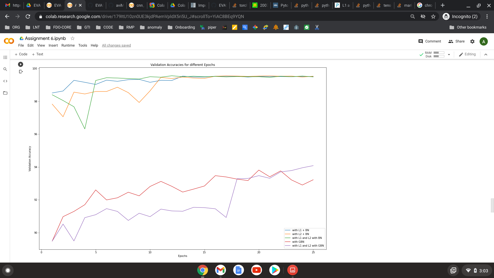
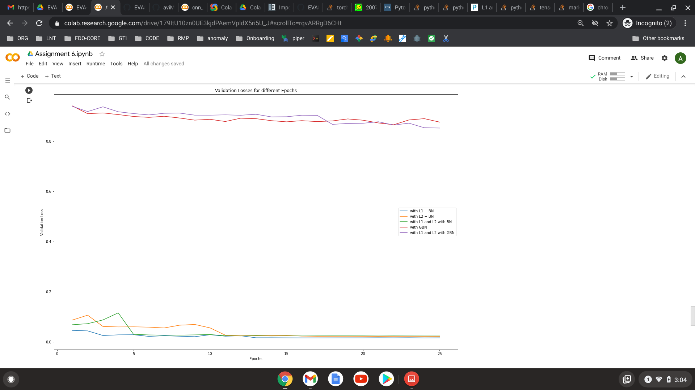
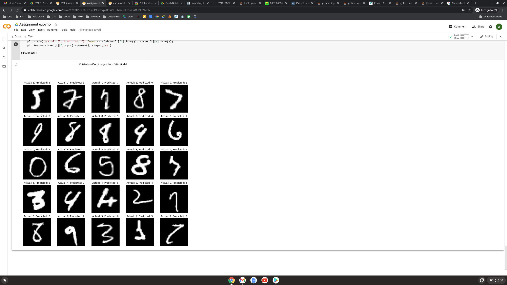

<h1>Assignment 6</h1>

This notebook contains a lot of reusable code for comparitive analysis of different Regularization techniques:
1. Batch Normalization
2. Ghost Batch Normalization
3. L1 and L2 Regularization

The CNN Model COde is completely reusbale and uses moduleDict datastructures from PyTorch. 
With simple params like the name of the Activation function or the name of the Batch normalization we can tweak the behavior of the network. 
The results of the comparison are also shown in the notebook.

<h2>Accuracy Comparisons</h2>

<h2>Loss Comparisons</h2>

<h2>25 Misclassifications</h2>

